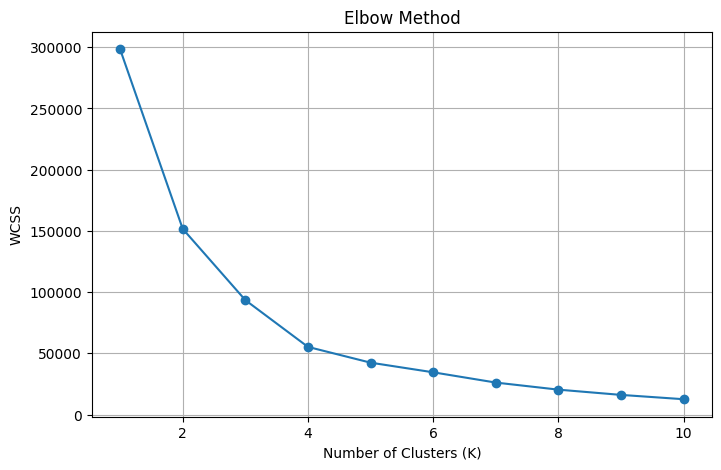

# Customer Spending Segmentation using K-Means Clustering

## Project Overview

This project applies the **K-Means Clustering** algorithm to segment retail customers into distinct spending groups based on their purchasing behavior. Since customer labels were not available, an **unsupervised machine learning** approach was used to identify natural customer segments.

The model classifies customers into three categories:

- 🟣 Low Spending
- 🟢 Medium Spending
- 🟡 High Spending

These segments can help businesses understand customer purchasing patterns and support data-driven marketing strategies.

---

## Objectives

- Perform customer segmentation using K-Means Clustering.
- Determine the optimal number of clusters using the Elbow Method.
- Classify customers into Low-, Medium-, and High-Spending groups.
- Visualize customer clusters.
- Generate insights that can support business decision-making.

---

## Dataset

**Dataset:** Customer Shopping Dataset

The dataset contains transactional information such as:

| Feature | Description |
|----------|-------------|
| Customer ID | Unique identifier for each customer |
| Age | Customer's age |
| Quantity | Number of products purchased |
| Price | Price of purchased products |
| TotalSpend | Total purchase amount (Quantity × Price) |
| Category | Product category |
| Payment Method | Mode of payment |
| Shopping Mall | Shopping location |

**Source:** [(Kaggle)](https://www.kaggle.com/code/amrheshamm/customer-shopping-dataset/input)

---

## Technologies Used

- Python
- Pandas
- NumPy
- Matplotlib
- Scikit-learn
- Jupyter Notebook

---

## Machine Learning Technique

### K-Means Clustering

K-Means is an unsupervised machine learning algorithm used to group similar data points into clusters.

This project uses K-Means to identify customers with similar purchasing behavior.

---

## Features Used for Clustering

The following features were selected:

- Quantity
- Price
- TotalSpend

These features were standardized before applying K-Means because they are measured on different scales.

---

## Determining the Number of Clusters

The **Elbow Method** was used to determine the optimal number of clusters.

The Within-Cluster Sum of Squares (WCSS) was calculated for different values of K, and the point where the curve began to flatten was selected as the optimal number of clusters.

**Optimal Number of Clusters:** 3

---

## Project Workflow

1. Load the dataset.
2. Perform data preprocessing.
3. Create the `TotalSpend` feature.
4. Standardize numerical features.
5. Apply the Elbow Method.
6. Train the K-Means model.
7. Assign cluster labels.
8. Rename clusters as:
   - Low Spending
   - Medium Spending
   - High Spending
9. Visualize customer segments.
10. Generate business insights.

---

## Results

The K-Means algorithm successfully segmented customers into three distinct spending groups.

### Low Spending Customers

- Small purchase amounts
- Lower-priced products
- Suitable for promotional campaigns

### Medium Spending Customers

- Moderate purchasing behavior
- Regular customers
- Opportunity for upselling

### High Spending Customers

- Highest purchase value
- Premium customers
- Ideal for loyalty programs and personalized offers

---

## Visualization

### Elbow Method

The Elbow Method was used to determine the optimal value of K.



---

### Customer Spending Clusters

Customers were visualized based on:

- X-axis → Total Spend
- Y-axis → Price

Each color represents one spending category.


---

## Key Takeaways

- Successfully implemented K-Means Clustering for customer segmentation.
- Identified three customer spending categories.
- High-spending customers contribute significantly to revenue.
- Medium-spending customers represent consistent buyers.
- Low-spending customers can be targeted with discounts and promotional offers.
- Customer segmentation can improve marketing effectiveness and customer retention strategies.

---

## Future Improvements

Some possible enhancements include:

- Evaluate clustering quality using the Silhouette Score.
- Compare K-Means with Hierarchical Clustering or DBSCAN.
- Build an interactive dashboard using Power BI or Tableau.
- Include additional customer behavior features for richer segmentation.

---

## Project Structure

```
Customer-Spending-Segmentation/
│
├── customer_spending_segmentation.ipynb
├── customer_shopping_data.csv
├── README.md
├── requirements.txt
└── images/
    ├── elbow_method.png
    └── customer_clusters.png
```

---

## How to Run

1. Clone this repository.

```bash
git clone https://github.com/yourusername/customer-spending-segmentation.git
```

2. Navigate to the project folder.

```bash
cd customer-spending-segmentation
```

3. Install the required libraries.

```bash
pip install -r requirements.txt
```

4. Open the Jupyter Notebook.

```bash
jupyter notebook
```

5. Run all notebook cells.

---

## Requirements

```
pandas
numpy
matplotlib
scikit-learn
jupyter
```

---

## Author

**Afsah Arshad**

Computer Science Student | Machine Learning Enthusiast

GitHub: https://github.com/afamarshad

LinkedIn: https://linkedin.com/in/afsaharshad/

---

## License

This project is intended for educational and portfolio purposes.
